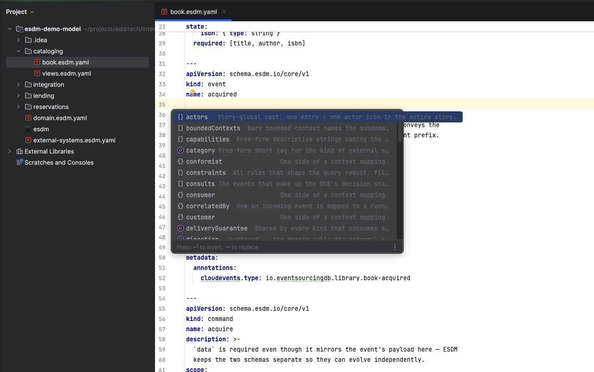
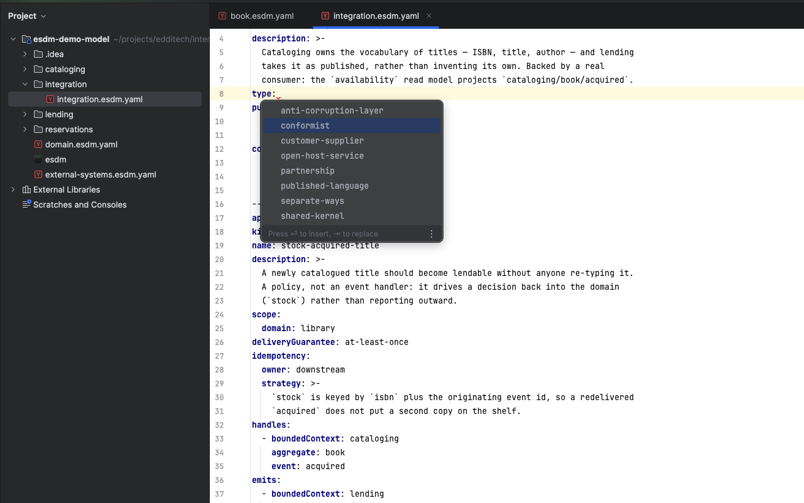
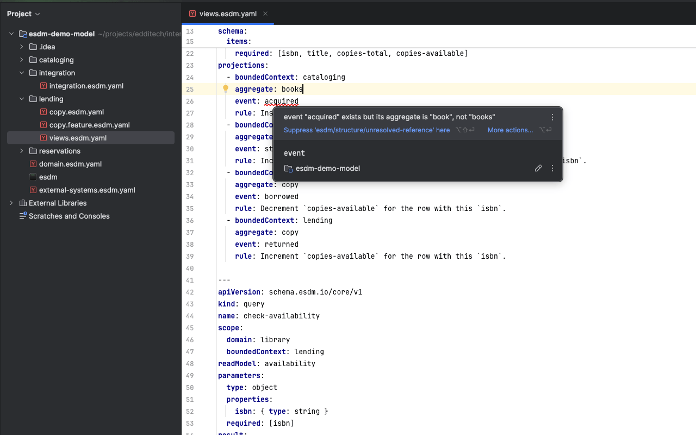
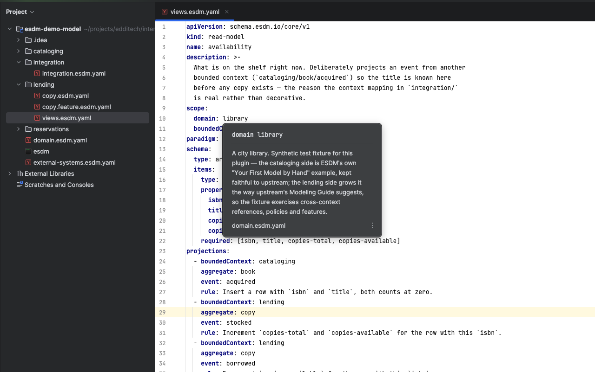
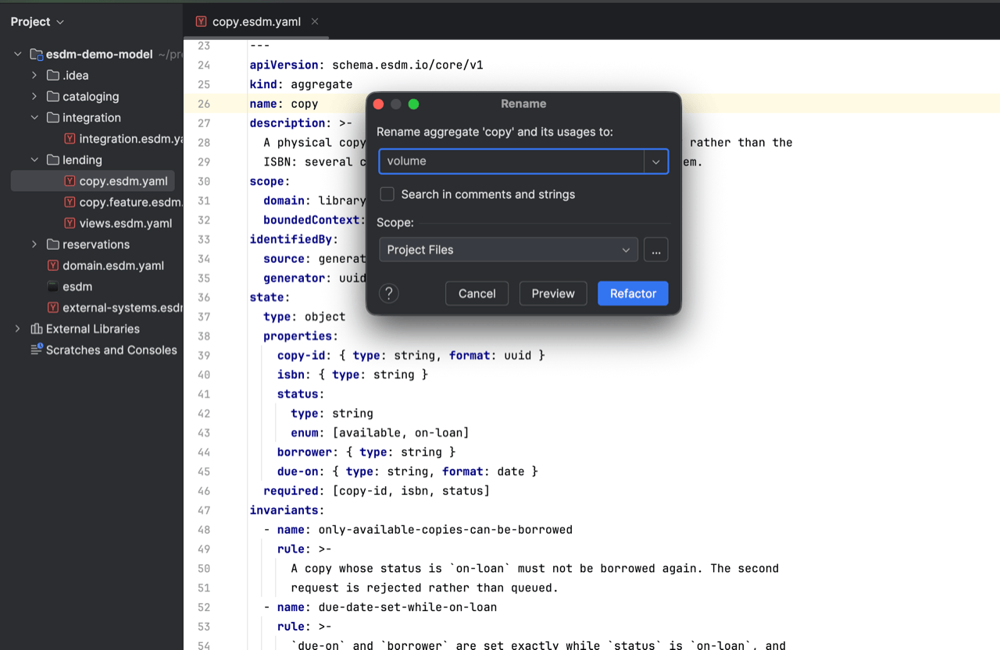

# esdm-jetbrains-plugin

Editor support for [ESDM](https://www.esdm.io/) — Event-Sourced Domain Modeling — in every
JetBrains IDE. ESDM describes a domain as YAML: bounded contexts, aggregates, commands, events,
policies and the rules binding them. This plugin makes those files behave like code rather than
text.

## What it does

**Completion that knows the document.** Inside a `kind: aggregate` you are offered
`identifiedBy` and `state`, not every field of every kind. A `context-mapping`'s `type` offers
the eight DDD mapping patterns, and once one is chosen only that variant's fields remain.





**Validation as you type.** The ESDM schemas are bundled and applied automatically, so the
per-document `# yaml-language-server: $schema=…` modeline the upstream docs describe is no
longer needed.



**The linter, inline.** `esdm lint` findings appear in the editor with their rule IDs, plus a
quick fix inserting `# esdm-lint-disable <rule-id>` where a model legitimately deviates.

**Navigation.** Ctrl-click a `domain`, `boundedContext`, `command` or `event` reference to reach
its declaration; hover for that artifact's own details. Find Usages answers "which policies
handle this event?". Gutter icons link a command to the events it publishes and back. Go to
Symbol finds any declaration by name.



**Rename.** Renaming a declaration carries every reference with it, across files and bounded
contexts — including the cascade when an aggregate's name appears in its commands' and events'
scope. Prose that merely mentions the name is left alone.



## The `esdm` binary

Optional. Everything except the linter works without it. It is looked for next to the project,
then on `PATH`, and can be pointed at explicitly under *Settings | Tools | ESDM*, along with the
model root. It is not bundled: it is platform-specific and pinned per project, since the linter
rejects local schemas that drift from the revision embedded in the binary.

```sh
curl -O https://esdm.s3.fr-par.scw.cloud/0.14.0/esdm-darwin-arm64
mv esdm-darwin-arm64 esdm && xattr -d com.apple.quarantine esdm && chmod a+x esdm
```

## Development

Requires a **JDK 21** — the target platform (build `252`) runs on Java 21, and building with a
newer JDK produces class files no IDE below 2026.2 can load.

```sh
./gradlew buildPlugin     # -> build/distributions/*.zip
./gradlew check           # tests
./gradlew runIde          # sandbox IDE with the plugin loaded
./gradlew verifyPlugin    # binary compatibility against the supported IDEs
```

The first run downloads IntelliJ IDEA Community 2025.2.6.3 (~1 GB) into the Gradle cache.

`runIde` is most useful with `src/test/testData/library/` opened as the project — a synthetic
33-document model that lints cleanly and is also the corpus the tests run against.

### The test model

`src/test/testData/library/` is deliberately synthetic; no client model is tracked here. The
cataloging side is ESDM's own [Your First Model by Hand](https://www.esdm.io/getting-started/your-first-model/)
example kept faithful to upstream, and the lending side grows it the way upstream's Modeling
Guide suggests — a second bounded context, a context mapping, a policy, an event handler, an
external system, and a Given-When-Then feature.

It must stay lint-clean:

```sh
./esdm lint -d src/test/testData/library    # no output, exit 0
./esdm view -d src/test/testData/library
```

A third context, `reservations/`, exists specifically to carry a
`dynamic-consistency-boundary` and the free-standing events that come with it. Without those,
the interesting half of an event reference is untestable: `{boundedContext, event}` and
`{boundedContext, aggregate, event}` look nearly identical and must never resolve to one
another.

Still uncovered, and worth adding when something needs them: `process-manager`, `subdomain`,
`entity`, `value-object`, `domain-service`, and `actor.backedBy`.

### Why Community as the compile target

Building against `IC` rather than the unified `IU` distribution is deliberate: Community builds
physically lack Ultimate-only classes, so the compiler stops us reaching for APIs that would
break the plugin in GoLand, WebStorm, PyCharm and the rest. IntelliJ IDEA stopped shipping
separate `IC` builds with 2025.3, so this guard rail only exists while we target `252`. Once the
floor moves past it, `verifyPlugin` becomes the only line of defence.


## ESDM references
Main site: [https://esdm.io](https://esdm.io).
Docs: [https://github.com/thenativeweb/esdm/tree/main/documentation/docs](https://github.com/thenativeweb/esdm/tree/main/documentation/docs)
Core Schema: [https://github.com/thenativeweb/esdm/blob/main/schema/core/v1.yaml](https://github.com/thenativeweb/esdm/blob/main/schema/core/v1.yaml)
Given-When-Then Schema: [https://github.com/thenativeweb/esdm/blob/main/schema/given-when-then/v1.yaml](https://github.com/thenativeweb/esdm/blob/main/schema/given-when-then/v1.yaml)
